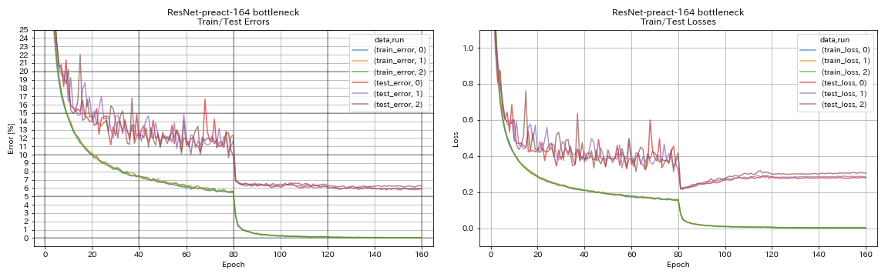

# PyTorch Implementation of ResNet-preact

## Requirements

* Python >= 3.6
* PyTorch >= 1.0.1
* torchvision
* [tensorboardX](https://github.com/lanpa/tensorboardX)
* [YACS](https://github.com/rbgirshick/yacs)


## Usage

```
$ python train.py model.block_type basic model.depth 110 run.outdir results
```

### Use PyramidNet-like Residual Unit

```
$ python train.py model.block_type basic model.depth 110 model.remove_first_relu True model.add_last_bn True run.outdir results
```

## Results on CIFAR-10

| Model                        | Test Error (median of 3 runs) | Test Error (in paper)   | Training Time |
|:-----------------------------|:-----------------------------:|:-----------------------:|--------------:|
| ResNet-preact-110            | 6.47                          | 6.37 (median of 5 runs) |   3h05m       |
| ResNet-preact-164 bottleneck | 5.90                          | 5.46 (median of 5 runs) |   4h01m       |




## References

* He, Kaiming, et al. "Deep residual learning for image recognition." Proceedings of the IEEE conference on computer vision and pattern recognition. 2016. [arXiv:1512.03385]( https://arxiv.org/abs/1512.03385 )
* He, Kaiming, et al. "Identity mappings in deep residual networks." European Conference on Computer Vision. Springer International Publishing, 2016. [arXiv:1603.05027]( https://arxiv.org/abs/1603.05027 ), [Torch implementation]( https://github.com/KaimingHe/resnet-1k-layers )


